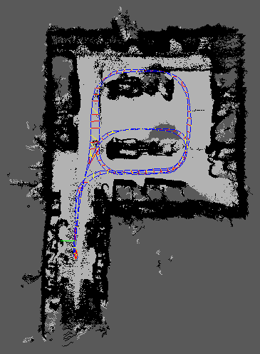
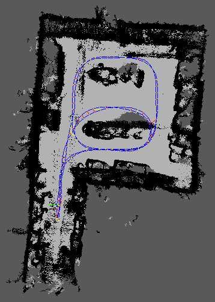
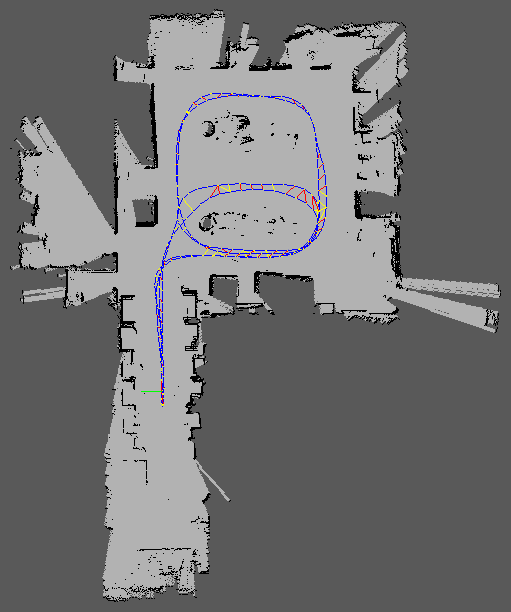

# Wheelchair Setup

This package lets you to use the various sensors mounted on the RRC wheelchair (Old-Timer) to Map, Localize, and Navigate in a indoor environment.

### Prerequisites
- Ubuntu 20.04
- [ROS Noetic](http://wiki.ros.org/noetic/Installation/Ubuntu) 
- [CUDA](https://developer.nvidia.com/cuda-12-2-0-download-archive) (tested on CUDA 12.6)
- [ZED SDK v4.1](https://www.stereolabs.com/en-in/developers/release)
- [RealSense SDK 2.0](https://dev.intelrealsense.com/docs/compiling-librealsense-for-linux-ubuntu-guide)
- Tested on LTS Kernel 5.15 


## Barebones Robot Setup

#### 1. Preliminary
- Install Google glog for voronoi planner. The version of v0.5.0 is tested.
```
$ sudo apt-get update && sudo apt-get upgrade && sudo apt-get dist-upgrade -y
$ sudo apt install autoconf automake libtool libunwind-dev
$ git clone https://github.com/google/glog.git
$ cd glog/
$ git checkout v0.5.0
$ mkdir build
$ cd build/
$ cmake ..
$ make -j4
$ sudo make install
```
- ROS Dependencies (Might have missed few, please do google the errors that appear while $ catkin_make to install the missing dependencies)

```
$ sudo apt install python3-rosdep python3-rosinstall python3-rosinstall-generator python3-wstool build-essential -y
$ sudo apt install python3-rosdep -y
$ sudo apt install ros-noetic-map-server
$ sudo apt install ros-noetic-ddynamic-reconfigure
$ sudo apt-get install liborocos-bfl-dev
$ sudo apt-get install ros-noetic-navigation
$ sudo apt-get install ros-noetic-geometry2
$ sudo apt-get install ros-noetic-geographic-info
$ sudo apt-get install ros-noetic-robot-navigation
$ sudo apt install 'ros-noetic-rtabmap*'
$ sudo apt-get install 'ros-noetic-gazebo*'
$ sudo apt-get install python3-catkin-tools
$ sudo apt-get install ros-noetic-image-geometry
$ sudo apt-get install 'ros-noetic-pcl*'
$ sudo apt-get install 'ros-noetic-laser-geometry*'
$ sudo apt-get install 'ros-noetic-costmap-2d*'
```

#### 2. Clone the repo and build
```
$ git clone https://github.com/rtarun1/wheelchair_ws.git
$ cd wheelchair_ws
$ rosdep install --from-paths src --ignore-src -r -y
$ catkin build
$ source ./devel/setup.bash
```
- If there is a CUDA error due to ZED packages, try adding the following export commands in .bashrc (or) .zshrc
```
export PATH=/usr/local/cuda-12.6/bin${PATH:+:${PATH}}
export CUDA_HOME=/usr/local/cuda-12.6
export LD_LIBRARY_PATH=$LD_LIBRARY_PATH:/usr/local/cuda-12.6/lib64
```

#### 3. Manual control
- Make sure to source the workspace every time you open a new terminal or if you work with multiple repo's 
```
$ source ./devel/setup.bash
$ roslaunch kangaroo_driver kangaroo_driver.launch
$ roslaunch teleop_twist_joy teleop.launch
```

## Autonomous Navigation 

### Hardware Initialization 

- By default this package assumes Realsense D455 RGBD camera is used, but it also supports ZED 2i stereo camera. Instructions on how to use ZED is provided at the end.

### Mapping and Localization (SLAM)
- There are two ways to localize the robot with map created using RTABMAP (1) RTABMAP-Localization (2) Adaptive Monte Carlo localization (AMCL).

#### RTABMAP for Mapping 
- This will erase all the previous rtabmap database at ~/.ros/rtabmap.db
```
$ roslaunch wheelchair_mapping data_collection.launch 
$ roslaunch wheelchair_mapping rs_lidar_rtabmap.launch
```
- Use the following command to visualize the map that was created ``` rtabmap-databaseViewer ~/.ros/rtabmap.db ```
#### 1. RTABMAP for Localization
```
$ roslaunch wheelchair_mapping data_collection.launch 
$ roslaunch wheelchair_mapping rs_lidar_rtabmap.launch localization:=true
```

#### 2. AMCL for Localization 
```
$ roslaunch wheelchair_nav_cameras amcl_working.launch
```

## Motion planning 
- The motion planning the done using DWB local planner and voronoi global planner which provided the best result compared to other classical planners. 

- Again the navigation task can be carried out either using AMCL or RTABMAP localization. 

#### 1. RTABMAP Navigation 
- Use "2D Nav Goal" in Rviz to give the goal destination. 
```
$ roslaunch wheelchair_mapping data_collection.launch 
$ roslaunch wheelchair_mapping rs_lidar_rtabmap.launch localization:=true
$ roslaunch wheelchair_nav_cameras wheelchair_rtab_nav.launch
```
#### 2. AMCL Navigation
- Use "2D Pose Estimation" in Rviz to give the current pose of the robot. 
- Use "2D Nav Goal" in Rviz to give the goal destination. 
```
$ roslaunch wheelchair_mapping data_collection.launch
$ roslaunch wheelchair_nav_cameras wheelchair_nav.launch
```

### ZED vision system for Navigation

Will be updated soon!


# Benchmarking 

## SLAM Results

- The test is conducted to find the optimal hardware setup to maximize the SLAM result.

- The path that the wheelchair took remained same for all the configurations.

#### 1. Using Realsense with only RtabMap visual odometry 



- As we can absorb from the figure, the costmap is very noisy with very few odometry drifts 

#### 2. Using Realsense with wheel-odometry 


- An obvious drift in the odom can be observed, which is expected when using wheel encoders as the only source of odom.

- And also due to the noise in pointcloud data the 2D costmap is pretty noisy.

#### 3. Using Realsense with wheel-odometry and laser scan


- With the Lidar scanner introduced the output 2D costmap is properly scaled and the noise is reduced so much.
- The improvement is due to two things (1) As LiDAR depth is calculated using its own light using triangulation rather than depending on external light source for depth as in RGBD camers. (2) ICP (Iterative Closest Point) which uses LiDAR to improve the odometry results and increase the precision of the loop closure

## Navigation Results 

- Was able to implement DWB local planner with voronoi global planner.  
- Initially was able to achieve good navigation results, but once the odometry drifts or a complex path is provided the voronoi planner fails. Even after altering the voronoi code, the planner is inconsistent. 

#### Due to these limitations it is better to migrate to ROS2 which uses Behaviour Tree (BT) Navigator, and Task-specific asynchronous servers which enables us to run multiple planners at the same time and react to different scenarios much faster. And also DWB or MPC planner in ROS2 is more modular. 

## Cite 
https://github.com/laksh-nanwani/wheelchair-camera-lidar/tree/master

